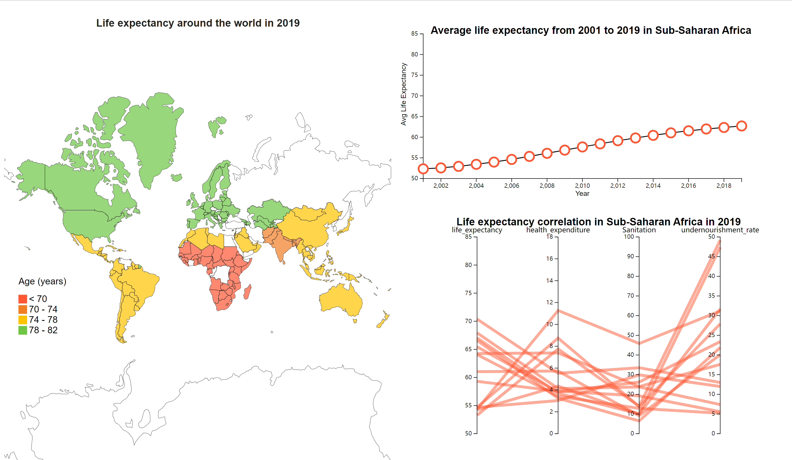

# Life-Expectancy

A visualization project of life expectancy around the world using VanillaJS.

## Project setup

```
npm install
```

```
npm run dev
```

## Visualization instruction

Please click on certain region on the map to see the corresponding scatterplot and parallel coordinate on the right side.
The map can be panned and zoomed.
You can hover your mouse on all of three charts to see specific information in tooltip. 

## Demo



## Description

A. Visual representations
The framework includes three principal view parts. 

1.Geographic map view
First, we have a geographic map showcasing an overview of the distribution of life expectancy of each country in 2019, which is our core part. We use lines and areas as the marks and position and color for channels. Different color represents different level of life expectancy of individual country. As is shown, North America, Europe & Central Asia have the highest life expectancy (green) while SSA region has the lowest life expectancy (red). Other regions’ life expectancy is in the middle (yellow or orange). 

2. Line chart view 
The right upper part is a line chart showcasing the trend of average life expectancy from 2001 to 2019 in the chosen country. We use points and lines as the marks, and we apply position and color for visual channels.

3. Parallel coordinate view
The right lower part is a parallel coordinate, each coordinate represents life expectancy, health expenditure, sanitation, and prevalence of undernourishment separately. This parallel coordinate will display the information of all countries in one region. We use lines as the marks, and we apply color and tilt for visual channels.

B. Interaction methods
1. Geographic map view interaction
The geographic map can zoom in/out as needed. Besides, users can get information about the country name, belonged region name, life expectancy, and average region life expectancy when they put the mouse hovering on the area of countries they are interested in. When audience find an interesting region they want to explore, they can click on the area of that region and there will display the statistical analysis (a line chart and a parallel coordinate) of that specific region on the right side of the map.

2. Line chart view interaction
When the mouse is hovering on the point in the line, there will be shown the year and the average life expectancy of the specific region.

3. Parallel coordinate view interaction
When the mouse is hovering on the line, there will be shown the name, life expectancy, health expenditure, sanitation, and prevalence of undernourishment of that specific country.
